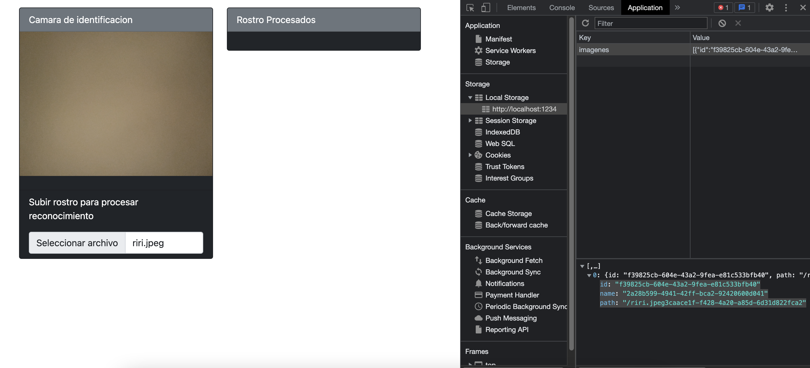

## Face-Api

$ npm i -y

[Parcel](https://parceljs.org/blog/v2/)

$ npm i parcel-bundler --save-dev

UUID: [uuid](https://duckduckgo.com/?q=npm+uuid&atb=v319-7&ia=software)

$ npm install uuid

face-api [face-api](https://github.com/justadudewhohacks/face-api.js/)

$ npm i face-api.js

$ npm i sass

